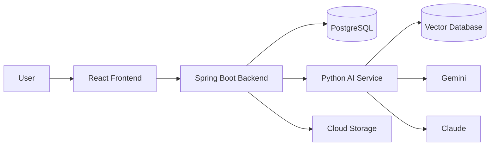
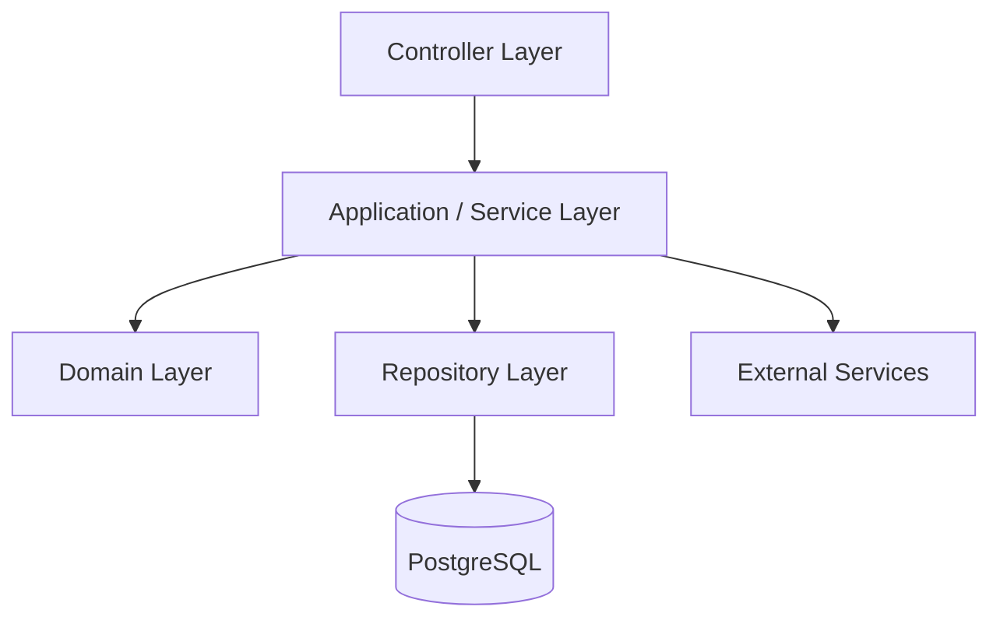
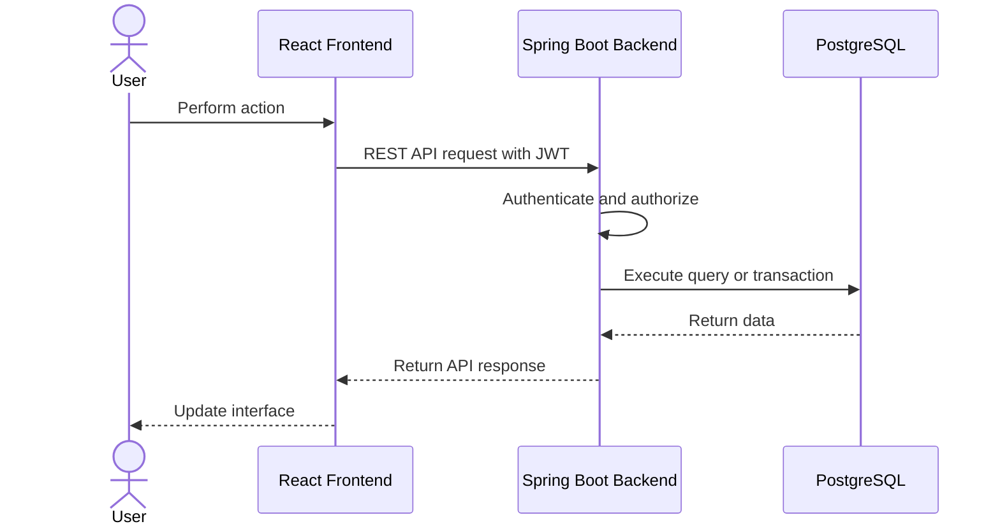
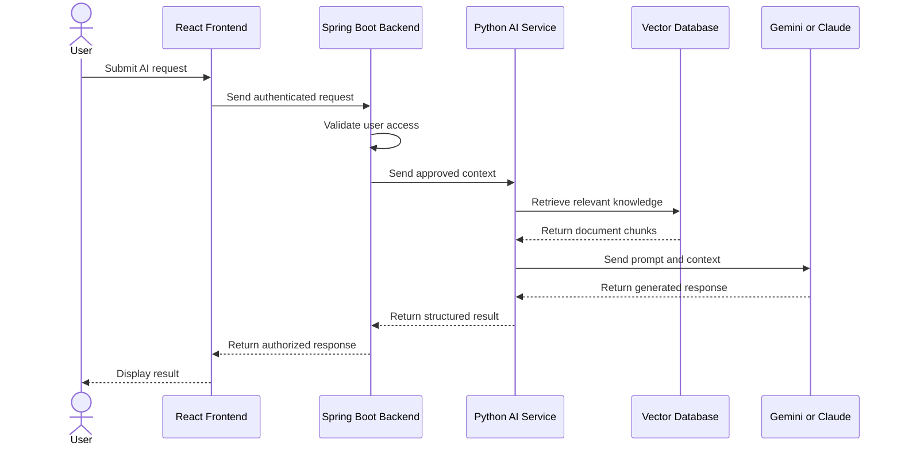
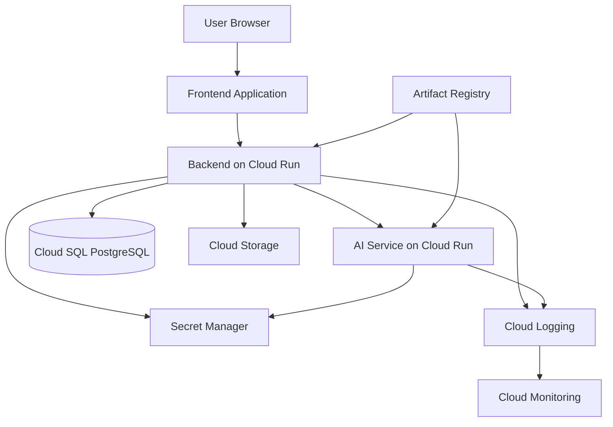

# Enterprise Operations Platform — High-Level Design

Version: 1.0  
Status: Draft  
Author: Vidyasagar Duvvari  
Last Updated: 2026-08-06

---

# 1. Purpose

This document describes the high-level architecture of the Enterprise Operations Platform.

It defines the major system components, their responsibilities, communication paths, security boundaries, and deployment model.

Detailed implementation decisions will be documented only when the relevant module is developed.

---

# 2. Architecture Goals

The architecture is designed to:

- Support incremental module-by-module development.
- Keep frontend, backend, AI, and database responsibilities separated.
- Protect business data through centralized authentication and authorization.
- Support local development using Docker.
- Support deployment to Google Cloud.
- Make components independently testable and maintainable.
- Provide a realistic enterprise architecture without unnecessary complexity.

---

# 3. Architecture Style

The platform will use a modular monolith for the main Spring Boot backend.

The overall system contains:

- React frontend
- Spring Boot backend
- PostgreSQL database
- Python AI service
- Vector database
- Google Cloud services

The Spring Boot backend is the central application layer.

The React frontend must not communicate directly with:

- PostgreSQL
- AI service
- Vector database
- Gemini
- Claude

All application requests must pass through the Spring Boot backend.

---

# 4. System Context



---

# 5. Major Components

## 5.1 React Frontend

Technology:

- React
- TypeScript
- Vite
- Tailwind CSS
- shadcn/ui
- React Router
- TanStack Query
- Zustand

Responsibilities:

- Render the user interface.
- Handle client-side navigation.
- Collect and validate user input.
- Call Spring Boot REST APIs.
- Display loading, success, and error states.
- Manage limited client-side UI state.
- Enforce route visibility based on authenticated user information.

The frontend does not make final authorization decisions. Authorization is always enforced by the backend.

---

## 5.2 Spring Boot Backend

Technology:

- Java 21
- Spring Boot
- Spring Security
- JWT
- JPA/Hibernate
- Flyway
- OpenAPI

Responsibilities:

- Expose REST APIs.
- Authenticate users.
- Enforce authorization.
- Validate incoming requests.
- Implement business rules.
- Access PostgreSQL.
- Coordinate AI requests.
- Manage document metadata.
- Record audit events.
- Return consistent API responses.
- Generate OpenAPI documentation.

The backend acts as the system’s primary security and business boundary.

---

## 5.3 PostgreSQL Database

Responsibilities:

- Store users, roles, permissions, organizations, projects, tasks, and audit records.
- Enforce relational integrity.
- Support transactions.
- Store application metadata.
- Support filtering, sorting, and reporting queries.

Schema changes will be managed through Flyway migrations.

Application code must not manually modify production database schemas.

---

## 5.4 Python AI Service

Technology:

- Python
- FastAPI
- Google ADK
- LangChain
- LangGraph
- Gemini
- Claude
- MCP

Responsibilities:

- Process AI-related requests from the Spring Boot backend.
- Perform prompt orchestration.
- Execute agent workflows.
- Retrieve relevant knowledge.
- Generate embeddings.
- Query the vector database.
- Call supported large language models.
- Return structured responses to the backend.

The AI service must not be directly accessible from the React frontend.

The AI service must receive only the data required for the requested operation.

---

## 5.5 Vector Database

Responsibilities:

- Store document embeddings.
- Support semantic search.
- Return relevant document chunks.
- Support retrieval-augmented generation.

The final vector database technology will be selected when the RAG module is implemented.

---

## 5.6 Object Storage

Google Cloud Storage will be used for:

- Uploaded documents
- Attachments
- Generated files
- Large binary objects

PostgreSQL will store file metadata and storage references rather than large file contents.

---

# 6. Backend Internal Architecture

The Spring Boot backend will use a layered modular structure.



## Controller Layer

Responsibilities:

- Receive HTTP requests.
- Validate request structure.
- Call application services.
- Return HTTP responses.
- Map exceptions to consistent error responses.

Controllers must not contain business logic.

## Application or Service Layer

Responsibilities:

- Coordinate use cases.
- Apply business workflows.
- Manage transactions.
- Call repositories and external services.
- Enforce application-level rules.

## Domain Layer

Responsibilities:

- Represent business concepts.
- Contain important business rules.
- Define domain-specific behaviour.

## Repository Layer

Responsibilities:

- Read and write persistent data.
- Isolate database access.
- Use JPA/Hibernate.

---

# 7. Frontend Architecture

The frontend will be organized by business feature rather than only by technical file type.

Example:

```text
frontend/src/
├── app/
├── components/
├── features/
│   ├── authentication/
│   ├── users/
│   ├── organizations/
│   ├── projects/
│   └── tasks/
├── hooks/
├── lib/
├── routes/
├── services/
├── stores/
└── types/
```

Responsibilities:

- TanStack Query will manage server state.
- Zustand will manage limited client state.
- React Router will manage navigation.
- Shared visual components will be kept separate from business features.
- Feature-specific code will remain inside its feature module.

Zustand must not duplicate server data already managed by TanStack Query.

---

# 8. Communication Flow

## 8.1 Standard Application Request



## 8.2 AI Request



---

# 9. Authentication and Authorization

The initial authentication design will use JWT-based authentication.

High-level flow:

1. User submits email and password.
2. Spring Boot validates credentials.
3. The backend issues an access token.
4. The frontend sends the token with protected API requests.
5. Spring Security validates the token.
6. The backend applies role and permission checks.
7. Unauthorized requests are rejected.

Security principles:

- Passwords will be stored using secure one-way hashing.
- Access control will be enforced by the backend.
- Secrets will not be stored in source code.
- Sensitive information will not be written to logs.
- AI requests will follow the same authorization rules as standard requests.

The detailed token and refresh-token design will be decided during the authentication module.

---

# 10. Data Ownership

Each component has clear data ownership.

| Component | Data responsibility |
|---|---|
| React frontend | Temporary UI state |
| Spring Boot backend | Business rules and application workflows |
| PostgreSQL | Structured business data |
| Cloud Storage | Uploaded files and binary content |
| AI service | Temporary AI processing state |
| Vector database | Embeddings and searchable document chunks |

The AI service must not become the source of truth for business data.

PostgreSQL remains the source of truth for structured application data.

---

# 11. Local Development Architecture

Docker Compose will be used to run supporting services locally.

Initial local environment:

```text
Developer Machine
├── React Frontend
├── Spring Boot Backend
├── PostgreSQL
└── Docker Compose
```

Later phases may add:

```text
├── Python AI Service
└── Vector Database
```

The project will not introduce every service on the first day. Components will be added when required by the current module.

---

# 12. Google Cloud Deployment Architecture



Expected Google Cloud services:

- Cloud Run for backend and AI service containers.
- Cloud SQL for PostgreSQL.
- Cloud Storage for files.
- Secret Manager for credentials and API keys.
- Artifact Registry for container images.
- Cloud Logging for centralized logs.
- Cloud Monitoring for health and performance monitoring.

The frontend hosting option will be finalized during deployment implementation.

---

# 13. DevOps Architecture

GitHub Actions will support:

- Build validation.
- Automated tests.
- Static analysis.
- Container image creation.
- Deployment automation.

Initial pipeline:

```text
Pull Request or Push
        ↓
Install Dependencies
        ↓
Compile
        ↓
Run Tests
        ↓
Build Application
```

Deployment steps will be added only after the application is ready for Google Cloud.

---

# 14. Testing Strategy

The platform will use multiple testing levels.

## Frontend

- Component tests
- Hook tests
- Integration tests
- User-flow tests where appropriate

## Backend

- Unit tests
- Service tests
- Repository tests
- Controller integration tests
- Security tests

## AI Service

- Unit tests
- API tests
- Prompt and structured-output tests
- Retrieval-quality evaluations

## System

- End-to-end tests
- Container-based integration tests
- Deployment verification

Tests will be added while each module is developed rather than postponed until the end.

---

# 15. Observability

The application will support:

- Structured logging.
- Request correlation identifiers.
- Error logging.
- Health endpoints.
- Cloud Logging integration.
- Cloud Monitoring integration.
- Metrics where useful.

Sensitive data, passwords, tokens, and confidential document content must not be logged.

---

# 16. Key Architecture Decisions

The initial architecture uses the following decisions:

1. Use a monorepo to keep the learning project easy to manage.
2. Use a modular monolith for the Spring Boot backend.
3. Use a separate Python service for AI capabilities.
4. Route all AI requests through Spring Boot.
5. Use PostgreSQL as the primary source of truth.
6. Use Flyway for controlled database migrations.
7. Use REST APIs for frontend-to-backend communication.
8. Use Docker for consistent local environments.
9. Deploy containerized services to Google Cloud Run.
10. Add infrastructure only when required by a business module.

These decisions may evolve as the project grows. Significant changes will be recorded as architecture decisions.

---

# 17. Current Limitations

The initial design does not yet define:

- Exact database schema.
- Detailed API endpoints.
- Refresh-token strategy.
- Final vector database technology.
- Frontend hosting solution.
- Multi-tenancy model.
- Event-driven messaging.
- Detailed cloud networking.

These decisions will be made when the relevant module requires them.

---

# 18. Document History

| Version | Date | Description |
|---|---|---|
| 1.0 | 2026-08-06 | Initial high-level design |